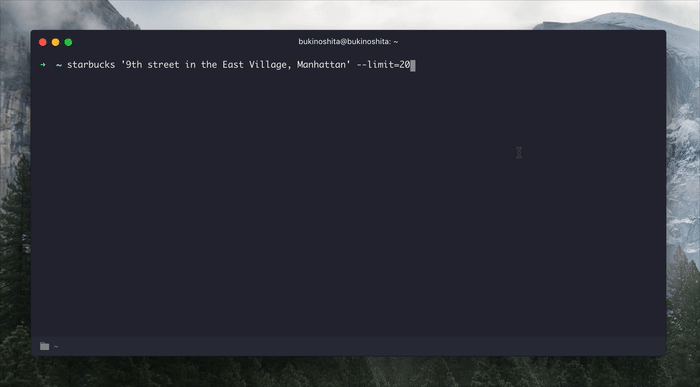

# starbucks-cli [](https://travis-ci.org/bukinoshita/starbucks-cli)

> Starbucks store finder CLI :coffee:


## Install

```
$ npm install -g starbucks-cli
```

## Usage

```bash
$ starbucks --help

  Usage:
    $ starbucks                    Show Starbucks stores near you
    $ starbucks <address>          Show Starbucks stores near address
    $ starbucks <zipcode>          Show Starbucks stores near zipcode

  Example:
    $ starbucks
    $ starbucks '1201 S Figueroa St, Los Angeles, CA 90015, USA'
    $ starbucks 'M6K 3P6' --limit=50

  Options:
    -l, --limit                     Limit of Starbucks to be shown
```


## Demo




## Related

- [starbucks-store-finder](https://github.com/bukinoshita/starbucks-store-finder) — API for this module
- [wer](https://github.com/bukinoshita/wer) — Get your geolocation information :round_pushpin:


## License

MIT © [Bu Kinoshita](https://bukinoshita.io)
